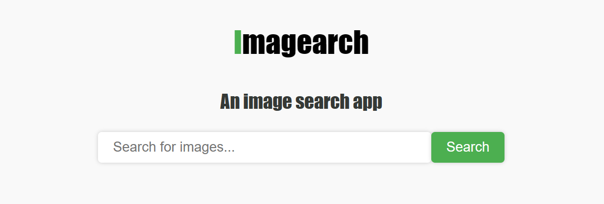
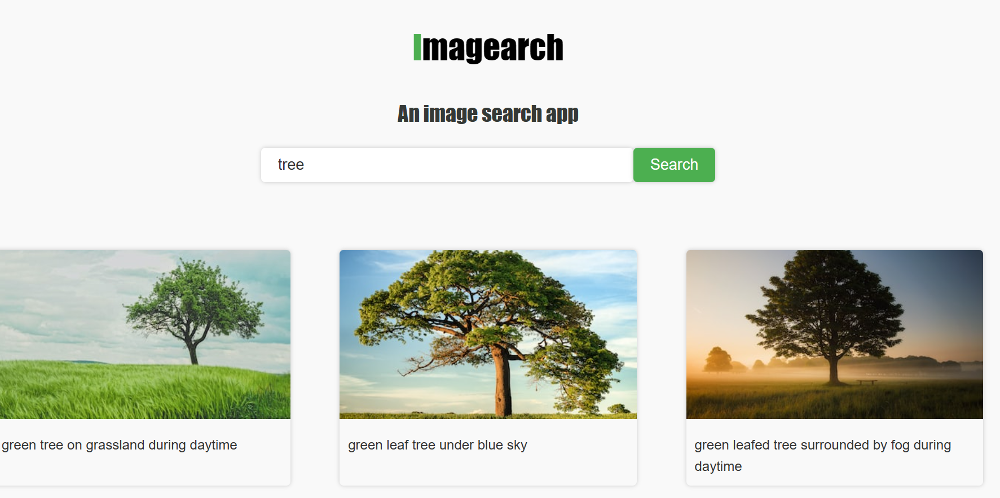

# Imagearch

Image Search App
## Overview
The Image Search App is a powerful tool for searching and discovering images from various sources on the web. This application leverages [insert technology/API/platform] to provide a seamless and intuitive image search experience.

## Features
- Search: Users can enter keywords or phrases to search for images related to their interests.

- Filtering: Refine your search results with filters such as image type, size, color, and source.

- Preview: Easily preview images in the search results without leaving the app.

- Download: Download high-quality images directly to your device.

- Favorites: Save your favorite images for later reference.

- History: Keep a history of your searches for quick access to past queries.

- User-Friendly Interface: The app offers an intuitive and user-friendly interface for an effortless search experience.

## How to Use
- Installation:

Clone this repository to your local machine.

- Run the App:

Open the index.html file in your web browser.

- Search for Images:

Enter keywords or phrases into the search bar.

Use filters to refine your search results, if desired.

- Preview and Download:

Click on an image in the search results to preview it.

Click the "Download" button to save the image to your device.

- Favorites:

Use the "Favorites" feature for easy access to your saved images and past searches.

## Feedback and Contributions
We welcome your feedback and contributions to improve the Image Search App. If you have ideas for enhancements or encounter issues, please open an issue.

